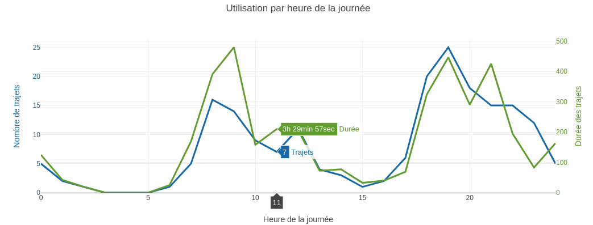

# Vélib'rairie

Voici un outil pour analyser plus en détails votre historique de trajets à Vélib'. La librairie va lire l'historique de vos trajets (sans aucune atteinte à votre vie privée, comme indiqué plus bas), et les résumer dans de jolis graphiques.

## Résultat

Voici un exemple de graphique que vous obtiendrez :


## Utilisation

- Ouvrir le navigateur internet de votre choix (nous avons testé Firefox et Chrome).
- Aller sur le site https://www.velib-metropole.fr, se connecter et aller dans « Mon compte ».
- Faire clic droit > inspecter. Un panneau compliqué s'ouvre sur un côté de l'écran.
- Aller dans l'onglet "Console" de ce panneau.
- Dans la zone indiquée par `>` ou `>>`, coller ce code :
```javascript
$.getScript("https://cdn.jsdelivr.net/gh/lecfab/velibrairie/velibrairie.js").done(velibrarie)
```
- Appuyer sur Entrée et attendre quelques secondes pendant que les données sont récupérées. Le panneau peut être fermé.
- Contempler les graphiques.

## Vie privée et sécurité

Le script est entièrement local :
il n'envoie rien à personne,
vos données restent sur votre ordinateur.
Il ne peut pas accéder à votre mot de passe ni à vos informations personnelles. Pour vous en assurer, vous pouvez regarder le code source et voir qu'aucune URL n'est appelée, hormis le chargement du script lui-même.

## Contributions

Fabrice Lécuyer, 2022

Ce projet n'est pas officiel et n'est lié ni à Vélib-métropole ni à Smovengo.
